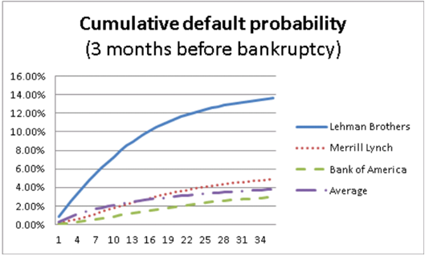

# Техническое задание для кейса 
## "Прогнозирование кривой вероятности дефолта"

---

## 1. Введение и постановка задачи

### 1.1 Контекст

Прогнозирование дефолта компаний является ключевой задачей в управлении кредитными рисками. Однако стандартные модели часто предсказывают дефолт только на фиксированном горизонте (например, 1 год), что недостаточно для полноценной оценки кредитного риска. Банкам важно понимать, как меняется риск дефолта компании во времени: какая вероятность дефолта в ближайший квартал, через год, через два года и т.д, чтобы принимать решения сейчас.

В данном кейсе вам предстоит построить модель, которая для каждой компании предсказывает **полную кривую вероятности дефолта** на горизонт до 3-х лет с квартальной гранулярностью.

### 1.2 Данные

Датасет содержит финансовую отчетность российских компаний (форма №1 «Бухгалтерский баланс» и форма №2 «Отчет о финансовых результатах»), а также информацию о самих компаниях. Данные загружены на Hugging Face.

#### Скачивание данных

```python
# Установка необходимых библиотек
!pip install datasets polars

from datasets import load_dataset
import polars as pl

# Загрузка данных с Hugging Face
dataset = load_dataset("Danisimmilian/GSOM_summer_school_Sber")

# Преобразование в Polars DataFrame
train_df = pl.DataFrame(dataset["train"])
test_df = pl.DataFrame(dataset["test"])

print(f"Train shape: {train_df.shape}")
print(f"Test shape: {test_df.shape}")
```

#### Почему Polars?

**Polars** — это современная библиотека для работы с данными, которая имеет ряд преимуществ перед pandas:

| Характеристика | Polars | Pandas |
|----------------|--------|--------|
| **Скорость** | Значительно быстрее за счет использования Apache Arrow и многопоточности | Медленнее на больших данных |
| **Память** | Более эффективное использование памяти | Требует больше памяти |
| **Ленивые вычисления** | Поддерживает `.lazy()` для оптимизации запросов | Только eager-вычисления |
| **Синтаксис** | Более интуитивный цепочечный синтаксис | Традиционный синтаксис |
| **Отсутствие индексов** | Работает без индексов, что упрощает многие операции | Сильно завязан на индексы |

#### Базовые команды в Polars

```python
import polars as pl

# Чтение данных
df = pl.read_parquet("data.parquet")

# Базовые операции
df.head(10)                                  # Первые 10 строк
df.describe()                                # Статистика
df.filter(pl.col("default") == 1)            # Фильтрация
df.select(["inn", "region", "line_1100"])    # Выбор колонок
df.with_columns(                             # Создание новой колонки
    (pl.col("line_1100") / pl.col("line_1600")).alias("leverage")
)
df.group_by("region").agg(                   # Агрегация
    pl.col("default").mean().alias("default_rate")
)
df.sort("year", descending=True)             # Сортировка

# Ленивые вычисления для больших данных
lazy_df = df.lazy()
result = lazy_df.filter(pl.col("default") == 1).collect()
```

---

## 2. Описание колонок датасета

### 2.1 Общая информация о компании

| Колонка | Описание |
|---------|----------|
| `main_date` | Основная дата отчетности |
| `report_date` | Дата формирования отчета |
| `year` | Год отчетности |
| `quarter` | Квартал (0 обычно означает годовой отчет) |
| `inn` | ИНН (Идентификационный номер налогоплательщика) |
| `ogrn` | ОГРН (Основной государственный регистрационный номер) |
| `region_taxcode` | Код налогового органа (ИФНС) |
| `creation_date` | Дата регистрации компании |
| `dissolution_date` | Дата ликвидации компании |
| `age` | Возраст компании в годах |
| `region` | Субъект Российской Федерации |
| `region_code` | Код региона |
| `lon`, `lat` | Географические координаты |
| `geocoding_quality` | Качество геокодирования |

### 2.2 Классификаторы и виды деятельности

| Колонка | Описание |
|---------|----------|
| `okved` | Код ОКВЭД2 |
| `okved_section` | Раздел ОКВЭД2 |
| `okved_explain` | Расшифровка ОКВЭД2 |
| `okpo` | ОКПО (Общероссийский классификатор предприятий и организаций) |
| `okopf` | Код ОКОПФ (организационно-правовая форма) |
| `okopf_explain` | Расшифровка ОКОПФ |
| `okogu` | Код ОКОГУ (органы государственной власти) |
| `okogu_explain` | Расшифровка ОКОГУ |
| `okfc` | Код ОКФС (форма собственности) |
| `okfc_explain` | Расшифровка ОКФС |
| `oktmo` | ОКТМО (Общероссийский классификатор территорий муниципальных образований) |
| `oktmo_explain` | Расшифровка ОКТМО |

### 2.3 Финансовые показатели и отчетность

#### Бухгалтерский баланс (Актив)

| Колонка | Описание |
|---------|----------|
| `line_1110` | Нематериальные активы |
| `line_1120` | Результаты исследований и разработок |
| `line_1130` | Нематериальные поисковые активы |
| `line_1140` | Материальные поисковые активы |
| `line_1150` | Основные средства |
| `line_1160` | Доходные вложения в материальные ценности |
| `line_1170` | Финансовые вложения |
| `line_1180` | Отложенные налоговые активы (ОНА) |
| `line_1190` | Прочие внеоборотные активы |
| `line_1100` | **ИТОГО по разделу I** (Внеоборотные активы) |
| `line_1210` | Запасы |
| `line_1220` | НДС по приобретенным ценностям |
| `line_1230` | Дебиторская задолженность |
| `line_1240` | Финансовые вложения (кроме денежных эквивалентов) |
| `line_1250` | Денежные средства и денежные эквиваленты |
| `line_1260` | Прочие оборотные активы |
| `line_1200` | **ИТОГО по разделу II** (Оборотные активы) |
| `line_1600` | **БАЛАНС** (Актив) |

#### Бухгалтерский баланс (Пассив)

| Колонка | Описание |
|---------|----------|
| `line_1310` | Уставный капитал |
| `line_1320` | Собственные акции, выкупленные у акционеров |
| `line_1340` | Переоценка внеоборотных активов |
| `line_1350` | Добавочный капитал (без переоценки) |
| `line_1360` | Резервный капитал |
| `line_1370` | Нераспределенная прибыль (непокрытый убыток) |
| `line_1300` | **ИТОГО по разделу III** (Капитал и резервы) |
| `line_1410` | Заемные средства (долгосрочные) |
| `line_1420` | Отложенные налоговые обязательства (ОНО) |
| `line_1430` | Оценочные обязательства (долгосрочные) |
| `line_1450` | Прочие долгосрочные обязательства |
| `line_1400` | **ИТОГО по разделу IV** (Долгосрочные обязательства) |
| `line_1510` | Заемные средства (краткосрочные) |
| `line_1520` | Кредиторская задолженность |
| `line_1530` | Доходы будущих периодов |
| `line_1540` | Оценочные обязательства (краткосрочные) |
| `line_1550` | Прочие краткосрочные обязательства |
| `line_1500` | **ИТОГО по разделу V** (Краткосрочные обязательства) |
| `line_1700` | **БАЛАНС** (Пассив) |

#### Отчет о финансовых результатах (ОФР)

| Колонка | Описание |
|---------|----------|
| `line_2110` | Выручка |
| `line_2120` | Себестоимость продаж |
| `line_2100` | Валовая прибыль (убыток) |
| `line_2210` | Коммерческие расходы |
| `line_2220` | Управленческие расходы |
| `line_2200` | Прибыль (убыток) от продаж |
| `line_2310` | Доходы от участия в других организациях |
| `line_2320` | Проценты к получению |
| `line_2330` | Проценты к уплате |
| `line_2340` | Прочие доходы |
| `line_2350` | Прочие расходы |
| `line_2300` | Прибыль (убыток) до налогообложения |
| `line_2410` | Текущий налог на прибыль |
| `line_2411` | Постоянные налоговые обязательства (активы) |
| `line_2412` | Изменение отложенных налоговых обязательств |
| `line_2421` | Изменение отложенных налоговых активов |
| `line_2430` | Изменение налоговых активов и обязательств |
| `line_2450` | Прочее |
| `line_2460` | Чистая прибыль (убыток) |
| `line_2400` | **Чистая прибыль (убыток)** |

#### Отчет о движении денежных средств (ОДДС)

| Колонка | Описание |
|---------|----------|
| `line_4110`, `line_4111`, `line_4112`, `line_4113`, `line_4119`, `line_411x` | Поступления от текущих операций |
| `line_4120`, `line_4121`, `line_4122`, `line_4123`, `line_4124`, `line_4129`, `line_412x` | Платежи по текущим операциям |
| `line_4100` | **Сальдо денежных потоков от текущих операций** |
| `line_4210`, `line_4211`, `line_4212`, `line_4213`, `line_4214`, `line_4219`, `line_421x` | Поступления от инвестиционных операций |
| `line_4220`, `line_4221`, `line_4222`, `line_4223`, `line_4224`, `line_4229`, `line_422x` | Платежи по инвестиционным операциям |
| `line_4200` | **Сальдо денежных потоков от инвестиционных операций** |
| `line_4310`, `line_4311`, `line_4312`, `line_4313`, `line_4314`, `line_4319`, `line_431x` | Поступления от финансовых операций |
| `line_4320`, `line_4321`, `line_4322`, `line_4323`, `line_4329`, `line_432x` | Платежи по финансовым операциям |
| `line_4300` | **Сальдо денежных потоков от финансовых операций** |
| `line_4400` | **Чистое изменение денежных средств за период** |
| `line_4450` | Остаток денежных средств на начало периода |
| `line_4490` | Остаток денежных средств на конец периода |
| `line_4500` | Величина влияния изменений курса иностранной валюты |

#### Отчет об изменениях капитала

| Колонка | Описание |
|---------|----------|
| `line_3100`, `line_3200`, `line_3210`-`line_321x` | Величина капитала на начало/конец периода |
| `line_3220`-`line_322x` | Увеличение капитала |
| `line_3230`, `line_3240` | Уменьшение капитала |
| `line_3300`, `line_3310`-`line_331x` | Резервный капитал |
| `line_3320`-`line_332x` | Изменения резервного капитала |
| `line_3330`, `line_3340` | Изменения нераспределенной прибыли |
| `line_3400`, `line_3401`, `line_3402`, `line_3410`, `line_3411`, `line_3412`, `line_3420`, `line_3421`, `line_3422` | Корректировки в связи с изменением учетной политики |
| `line_3500`, `line_3501`, `line_3502`, `line_3600` | Чистые активы |

#### Отчет о целевом использовании средств

| Колонка | Описание |
|---------|----------|
| `line_6100` | Остаток средств на начало отчетного года |
| `line_6200`, `line_6210`, `line_6215`, `line_6220`, `line_6230`, `line_6240`, `line_6250` | Поступило средств |
| `line_6300`, `line_6310`, `line_6311`, `line_6312`, `line_6313` | Использовано средств |
| `line_6320`-`line_6326`, `line_6330`, `line_6350`, `line_6400` | Расходы и остаток средств на конец периода |

#### Отчетность и финансовые показатели

| Колонка | Описание |
|---------|----------|
| `line_2500`, `line_2510`, `line_2520`, `line_2530` | Расшифровка прибыли (убытка) |
| `line_2900`, `line_2910` | Базовая и разводненная прибыль (убыток) на акцию |

### 2.4 Дополнительная информация о компании и признаки

| Колонка | Описание |
|---------|----------|
| `eligible` | Соответствие критериям льготы |
| `exemption_criteria` | Критерии освобождения |
| `financial` | Флаг финансовой отчетности |
| `filed` | Флаг сдачи отчетности |
| `imputed` | Применение ЕНВД |
| `simplified` | Применение УСН |
| `articulated` | Флаг наличия пояснительной записки |
| `totals_adjustment` | Признак корректировки итогов |
| `outlier` | Признак статистического выброса |
| `company_size` | Категория предприятия (микро, малое, среднее, крупное) |
| `neg_rev_flag` | Флаг отрицательной выручки |
| `decrease_rev_flag` | Флаг снижения выручки |
| `default` | Признак дефолта (1/0) |

---

## 3. Конструирование финансовых признаков

### 3.1 Почему недостаточно использовать "сырые" квартальные данные?

В датасете представлены квартальные финансовые показатели. Однако использование показателей из ОФР и ОДДС в "сыром" виде некорректно по двум причинам:

1. **Сопоставимость компаний во времени:** Финансовые коэффициенты, построенные на квартальных данных, несопоставимы для разных кварталов. Например, коэффициент рентабельности за 1-й квартал не сопоставим с коэффициентом за 4-й квартал (из-за сезонности и накопления показателей в отчетности).

2. **Панельная структура данных:** Для корректного сравнения компаний в рамках панельного датасета показатели должны быть приведены к единому знаменателю — годовому эквиваленту.

### 3.2 Преобразование к LTM (Last Twelve Months)

**LTM** — это сумма показателей за последние 4 квартала (12 месяцев). LTM позволяет:

- Привести показатели к годовому эквиваленту, обеспечивая сопоставимость между компаниями в разных кварталах
- Получить стабильную оценку финансового состояния компании
- Корректно рассчитывать финансовые коэффициенты в панельном датасете

**Важно:** LTM рассчитывается как сумма доступных квартальных значений. Если данные за какие-то кварталы отсутствуют, то:
- При наличии данных за 3 квартала из 4 — можно использовать сумму 3 кварталов с годовым пересчетом
- При наличии данных за 2 квартала и менее — показатель помечается как пропуск или заполняется с помощью интерполяции

```python
import polars as pl

def calculate_ltm(df: pl.DataFrame, column: str) -> pl.Expr:
    """
    Расчет LTM для показателя с учетом пропусков.
    Используется сумма по доступным кварталам с возможной интерполяцией.
    """
    # Сортировка по компании и дате
    return (
        df
        .with_columns([
            # Заполняем пропуски предыдущим значением (forward fill)
            pl.col(column).forward_fill().over("inn")
        ])
        .with_columns([
            # LTM = сумма за текущий и 3 предыдущих квартала
            pl.col(column).rolling_sum(window_size=4, by="inn").alias(f"{column}_ltm")
        ])
    )
```

### 3.3 Разделение на Level и Trend
Также полезными могут быть следующие приведения финансовых данных к справледливым признакам.

**Level — среднее значение за последние 12 месяцев (или 4 квартала)**

Характеризует "нормальное" состояние компании.

```
level = среднее(LTM за текущий и 3 предыдущих квартала)
```

**Trend — отклонение текущего LTM от среднегоШ**

Характеризует направление движения показателя.

```
trend = текущий LTM - level
 ```

## 4. Терминология

### 4.1 Ключевые понятия

#### Кривая вероятности дефолта (Default Probability Curve)

Это последовательность вероятностей того, что компания допустит дефолт до каждого из будущих периодов. В нашем случае — 12 кварталов вперед.

```
Квартал:    1      2      3     ...    12
Вероятность: P1     P2     P3    ...    P12
```

Где P1 — вероятность дефолта на горизонте 1-ого квартала, P2 — на горизонте 2-х кварталов, и т.д.

#### Квартальная гранулярность

Это означает, что мы предсказываем вероятности с шагом в 1 квартал (3 месяца). Горизонт 3 года = 12 кварталов.

#### Горизонт прогнозирования (Prediction Horizon)

Период времени, на который мы делаем прогноз. Например:
- Горизонт 1 квартал: прогноз на ближайшие 3 месяца
- Горизонт 4 квартала: прогноз на ближайший год
- Горизонт 12 кварталов: прогноз на 3 года

#### Уровень организаций

Модель строит прогноз для каждой компании индивидуально, а не для портфеля или отрасли в целом.

### 4.2 Схематичное представление задачи

```
    ┌─────────────────────────────────────────────────────────────┐
    │                                                             │
    │  Входные данные (на момент t)                               │
    │  ┌───────────────────────────────────────────────────────┐  │
    │  │ • Финансовые показатели (line_*)                      │  │
    │  │ • Информация о компании (age, etc)                    │  │
    │  │ • Классификаторы (регион, ОКВЭД, ОКОПФ, ОКФС, ОКОГУ)  │  │
    │  │ • Дополнительные признаки (company_size, outlier,     │  │
    │  │   eligible, simplified, imputed, etc)                 │  │
    │  └───────────────────────────────────────────────────────┘  │
    │                          │                                  │
    │                          ▼                                  │
    │  ┌─────────────────────────────────────────────────────┐    │
    │  │               Предобработка признаков               │    │
    │  └─────────────────────────────────────────────────────┘    │
    │                          │                                  │
    │                          ▼                                  │
    │  ┌─────────────────────────────────────────────────────┐    │
    │  │                    МОДЕЛЬ                           │    │
    │  └─────────────────────────────────────────────────────┘    │
    │                          │                                  │
    │                          ▼                                  │
    │  Выходные данные (кривая вероятностей на 12 кварталов)      │
    │  ┌─────────────────────────────────────────────────────┐    │
    │  │  Q1   Q2   Q3   Q4   Q5   Q6   Q7   Q8   Q9  Q10  Q11 Q12│
    │  │ [0.5%][0.7%][1.0%][1.5%][2.1%][2.8%][3.6%][4.5%][5.5%]   │
    │  └─────────────────────────────────────────────────────┘    │
    │                                                             │
    └─────────────────────────────────────────────────────────────┘
```

---

## 5. Построение целевых переменных (таргетов)

### 5.1 Исходные данные

В датасете есть колонка `default` — бинарный признак дефолта для каждой записи (компания-квартал). `default = 1` означает, что компания допустила дефолт в этом квартале.

### 5.2 Построение таргетов для разных горизонтов

Для каждой компании в каждый момент времени t нам нужно создать 12 бинарных таргетов, соответствующих дефолту на каждом из 12 кварталов вперед.

#### Пример

Рассмотрим компанию X:

```
Время:      Q1  Q2  Q3  Q4  Q5  Q6  Q7  Q8  Q9  Q10 Q11 Q12
default:    0   0   0   1   1   1   1   1   1   1   1   1
                        ↑
                    Дефолт в Q4
```

Для момента времени t = Q1:
- Горизонт 1 (Q2): default = 0
- Горизонт 2 (Q3): default = 0  
- Горизонт 3 (Q4): default = 1 ← дефолт
- Горизонт 4 (Q5): default = 1 
- и т.д.

Для момента времени t = Q2:
- Горизонт 1 (Q3): default = 0
- Горизонт 2 (Q4): default = 1 ← дефолт
- и т.д.

Для момента времени t = Q3:
- Горизонт 1 (Q4): default = 1 ← дефолт
- и т.д.

Для момента времени t = Q4:
- Исключается из выборки, так как уже в дефолте
- и т.д.

#### Важное замечание

После того как компания допустила дефолт, она исключается из выборки для последующих горизонтов (т.к. уже не является "живой" компанией).

### 5.3 Схема построения таргетов

```
Для каждой записи (компания, квартал t):
    Для каждого горизонта h от 1 до 12:
        Если компания существует в квартале t+h И default в квартале t+h = 1 и дефолт в квартале t = 0:
            target_h = 1 (дефолт на горизонте h)
        Если компания существует в квартале t+h И default в квартале t+h = 0 и дефолт в квартале t = 0:
            target_h = 0 (нет дефолта на горизонте h)
        Иначе:
            target_h = пропуск (исключаем из выборки для этого горизонта)
```

---

## 6. Методологии

### 6.1 Подход 1: Отдельная модель для каждого горизонта (12 моделей)

**Идея:** Для каждого горизонта прогнозирования строится отдельная бинарная классификационная модель.

```
Модель 1: предсказывает default на 1 квартал вперед
Модель 2: предсказывает default на 2 квартала вперед
...
Модель 12: предсказывает default на 12 кварталов вперед
```

**Преимущества:**
- Простота реализации и интерпретации
- Каждая модель может использовать свою оптимальную архитектуру
- Легко добавить/убрать горизонты

**Недостатки:**
- Нет связности между горизонтами (кривая может быть негладкой)
- Много моделей для обучения и поддержки
- Каждая модель учится на своем подмножестве данных

**Возможные алгоритмы:** 
- Логистическая регрессия
- Градиентный бустинг (XGBoost, LightGBM, CatBoost)

---

### 6.2 Подход 2: Одна модель с признаком горизонта

**Идея:** Обучается одна модель, где в качестве дополнительного признака подается номер горизонта прогнозирования.

```
Признаки: все исходные признаки + horizon (1, 2, ..., 12)
Целевая переменная: default на этом горизонте
```

**Преимущества:**
- Одна модель вместо 12
- Модель "видит" связь между горизонтами
- Естественная гладкость кривой

**Недостатки:**
- Модель должна уметь обрабатывать признак горизонта
- Выборка дублируется N раз, где N - число горизонтов, что приводит к мультиколлинеарности

**Важно:** Для бустингов можно использовать **монотонные ограничения (monotonic constraints)**, чтобы вероятность дефолта не убывала с ростом горизонта.

```python
# Пример для LightGBM
import lightgbm as lgb

params = {
    'monotone_constraints': [0, 0, ..., 1],  # 1 для признака horizon
    # ...
}
```

**Возможные алгоритмы:** 
- Логистическая регрессия (с взаимодействиями)
- Градиентный бустинг с монотонными ограничениями

---

### 6.3 Подход 3: Моделирование интенсивности дефолта (Forward Intensity)

**Идея:** Вместо прямой оценки вероятности дефолта оценивается **интенсивность выхода в дефолт** (hazard rate), которая затем преобразуется в вероятности.

Этот подход основан на статье **Duan, Sun & Wang (2012)** "Multiperiod Corporate Default Prediction - A Forward Intensity Approach".

#### Интенсивность дефолта (Default Intensity)

Интенсивность λ(τ) — это условная вероятность дефолта в момент времени τ при условии, что компания "дожила" до этого момента.

Связь между интенсивностью и кумулятивной вероятностью дефолта:

P(дефолт до момента T) = 1 - exp(-∫₀ᵀ λ(s) ds)

В дискретном виде (по кварталам):

P(дефолт в квартале h) = 1 - exp(-λ(h))

P(дефолт за первые H кварталов) = 1 - exp(-Σ_{h=1..H} λ(h))

#### Архитектура подхода

```
┌─────────────────────────────────────────────────────────────────┐
│                                                                 │
│  Входные данные (признаки на момент t)                          │
│  ┌──────────────────────────────────────────────────────────┐   │
│  │ • Финансовые показатели                                  │   │
│  │ • Информация о компании                                  │   │
│  │ • Классификаторы                                         │   │
│  │ • Дополнительные признаки                                │   │
│  └──────────────────────────────────────────────────────────┘   │
│                          │                                      │
│                          ▼                                      │
│  ┌──────────────────────────────────────────────────────────┐   │
│  │              Модель интенсивности λ(h)                   │   │
│  │   λ(h) = exp(α₀(h) + α₁(h)·X₁ + ... + αₖ(h)·Xₖ)           │   │
│  └──────────────────────────────────────────────────────────┘   │
│                          │                                      │
│                          ▼                                      │
│  ┌──────────────────────────────────────────────────────────┐   │
│  │  Преобразование в вероятности дефолта                    │   │
│  │  P(h) = 1 - exp(-λ(h))                                   │   │
│  │  P_cum(H) = 1 - exp(-Σ_{h=1..H} λ(h))                    │   │
│  └──────────────────────────────────────────────────────────┘   │
│                          │                                      │
│                          ▼                                      │
│  ┌──────────────────────────────────────────────────────────┐   │
│  │  Кривая вероятностей на 12 кварталов                     │   │
│  └──────────────────────────────────────────────────────────┘   │
│                                                                 │
└─────────────────────────────────────────────────────────────────┘
```

#### Варианты реализации

**Вариант A: Отдельная модель для каждого горизонта**

Для каждого горизонта h строится модель, предсказывающая интенсивность λ(h):

λ(1) = exp(α₀(1) + α₁(1)·X₁ + ...)
λ(2) = exp(α₀(2) + α₁(2)·X₁ + ...)
...
λ(12) = exp(α₀(12) + α₁(12)·X₁ + ...)

**Вариант B: Единая оптимизация**

Обучается одна модель, где коэффициенты α(h) являются функциями от горизонта:

λ(h) = exp(β₀(h) + β₁(h)·X₁ + ...)

Где β₀(h), β₁(h), ... — параметрические функции от h (например, полиномы или сплайны).

---

## 7. Метрики оценки

### 7.1 Основная метрика: Gini = 2×ROC-AUC - 1

**ROC-AUC** (Area Under ROC Curve) — площадь под ROC-кривой. Характеризует способность модели ранжировать компании по риску дефолта.

**Gini = 2 × ROC-AUC - 1** — линейное преобразование ROC-AUC к шкале [-1, 1]:
- Gini = 1 → идеальная модель
- Gini = 0 → случайная модель
- Gini = -1 → модель, которая все перепутала

Значения >0.6 (ROC-AUC > 0.8) считается хорошим результатом.

### 7.2 Дополнительные метрики

- **Качество калибровки:** насколько предсказанные вероятности соответствуют реальным частотам дефолтов
- **Монотонность кривой:** проверка того, что кривая не убывает (см. раздел 7.3)

---

## 8. Требования к результатам модели

### 8.1 Кривая вероятности дефолта на 12 точек

Для каждой компании модель должна выдавать вектор из 12 вероятностей:

[p₁, p₂, p₃, ..., p₁₂]

Где pₕ — вероятность дефолта в h-м квартале.

### 8.2 Отсутствие пропусков

Все 12 значений должны быть определены (не NaN, не None). Если модель не может предсказать какой-то горизонт (например, из-за недостатка данных для обучения), следует использовать интерполяцию или экстраполяцию.

### 8.3 Монотонность кривой (неубывающая)

Кривая вероятности дефолта должна быть **неубывающей**:

p₁ ≤ p₂ ≤ p₃ ≤ ... ≤ p₁₂

**Почему это важно?**

Чем дальше мы смотрим в будущее, тем больше времени у компании, чтобы допустить дефолт. Поэтому кумулятивная вероятность дефолта не может уменьшаться с ростом горизонта.

**Исключение:** Для **форвардных вероятностей** (вероятность дефолта именно в конкретном квартале, а не "к этому моменту") кривая может иметь любую форму.

**Важно:** В требованиях указана неубывающая кривая, что соответствует **кумулятивным вероятностям** дефолта.

### 8.4 Поведение кривой перед дефолтом

Для компаний, которые допустили дефолт в тестовой выборке, кривая вероятности должна демонстрировать **рост** по мере приближения к дате дефолта:



---

## 9. Технические требования к модели

### 9.1 Сохранение модели в формате pickle

Модель должна сохраняться в стандартном формате pickle для воспроизводимости:

```python
import pickle

# Сохранение
with open("default_model.pkl", "wb") as f:
    pickle.dump(model, f)

# Загрузка
with open("default_model.pkl", "rb") as f:
    model = pickle.load(f)
```

### 9.2 Метод .predict()

Объект модели должен иметь метод `predict()`, принимающий DataFrame с признаками и возвращающий массив вероятностей:

```python
# Сигнатура метода
def predict(self, X: pl.DataFrame) -> np.ndarray:
    """
    Аргументы:
        X: Polars DataFrame с признаками для компаний
    
    Возвращает:
        np.ndarray формы (n_samples, 12) — вероятности дефолта 
        для каждого из 12 кварталов
    """
    ...
```

### 9.3 Интерпретируемость (для логистической регрессии/оптимизации)

Из модели должна быть возможность получить:
1. **Коэффициенты** при признаках — важность каждого признака
2. **Значимость коэффициентов** (p-values, стандартные ошибки)

```python
# Пример для логистической регрессии
class DefaultModel:
    def __init__(self, model):
        self.model = model
    
    def get_coefficients(self) -> dict:
        """Возвращает словарь {признак: коэффициент}"""
        ...
    
    def get_feature_importance(self) -> pd.DataFrame:
        """Возвращает DataFrame с коэффициентами и p-values"""
        ...
```

---

## 10. Ограничения

### 10.1 Технические ограничения

1. **Время обучения:** не более 1 часа на стандартном ноутбуке
2. **Время инференса:** не более 1 секунды на 1000 компаний
3. **Память:** не более 16 ГБ ОЗУ

### 10.2 Ограничения по данным

1. Использовать только предоставленные данные (без внешних источников)
2. Не использовать информацию из будущего (look-ahead bias)
3. Учитывать, что отчетность публикуется с задержкой (лаг 3 месяца) - в качестве даты использовать `main_date`

### 10.3 Ограничения по модели

1. Допускается использование любых алгоритмов машинного обучения
2. Предпочтение моделям с интерпретируемостью
3. Возможна ансамблирование моделей

---

## 11. План работы

### Этап 1: Исследовательский анализ данных (EDA)
- Изучение распределений признаков
- Анализ пропусков
- Корреляционный анализ
- Визуализация дефолтов во времени

### Этап 2: Преобразование признаков (FE)
- Извлечение trend\level\LTM признаков из финансовых признаков
- Создание коэффициентов\нелинейных трансформаций над преобразованными финансовыми признаками
- Дамми\категориальные признаки над строковыми признаками

### Этап 3: Построение таргетов
- Создание 12 бинарных таргетов для каждого горизонта
- Формирование выборок для обучения

### Этап 4: Разработка моделей
- Реализация как минимум одного из подходов
- Обучение и валидация

### Этап 5: Оценка и визуализация
- Расчет Gini для каждого горизонта
- Построение кривых для реальных компаний
- Интерпретация коэффициентов

### Этап 6: Подготовка финального решения
- Код в виде Jupyter Notebook
- Сохраненная модель в pickle
- Презентация

---

## 12. Дополнительные ресурсы

### Статья Duan et al. (2012)
**"Multiperiod Corporate Default Prediction - A Forward Intensity Approach"**
- Основной методологический источник
- Детально описывает подход с интенсивностью дефолта

### Рекомендуемые библиотеки
- `polars` — работа с данными
- `scikit-learn` — базовые модели (логистическая регрессия)
- `xgboost` / `lightgbm` / `catboost` — градиентный бустинг
- `statsmodels` — статистическая значимость коэффициентов
- `matplotlib` / `seaborn` — визуализация

---

## 13. Контакты и вопросы

По всем вопросам обращаться по следующим контактам в телеграмм:

Данил: @danilovicdanil

Иван: @ivan_sitnikoff


Удачи в решении кейса! 🚀